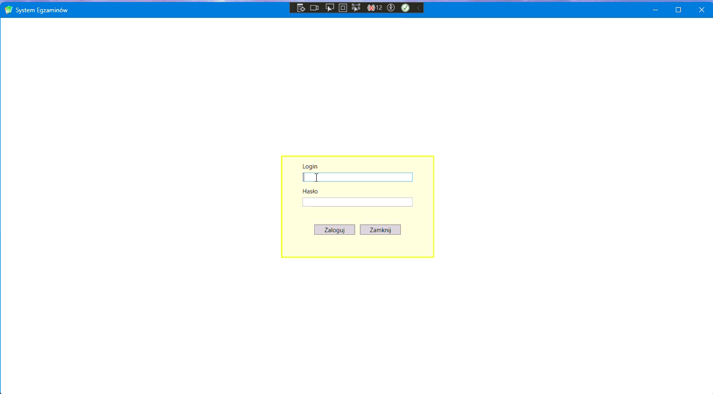
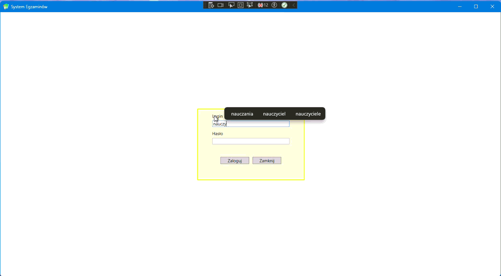

# System Egzaminów

System Egzaminów to aplikacja desktopowa przeznaczona do tworzenia,
przypisywania i przeprowadzania testów, sprawdzianów, kartkówek, kolokwiów oraz egzaminów i innych.

Aplikacja została napisana w języku C# z wykorzystaniem platformy .NET 8
i technologii WPF. Do obsługi danych wykorzystuje Entity Framework Core, LINQ
oraz Microsoft SQL Server.

## Status projektu

**v0.9.0-beta**

Projekt znajduje się obecnie w wersji beta. Podstawowe funkcjonalności
systemu są zaimplementowane i działają, natomiast aplikacja będzie dalej
rozwijana do wersji 1.0.

## Główne funkcjonalności

System obsługuje trzy role użytkowników: administratora, nauczyciela oraz ucznia.
Zakres dostępnych funkcjonalności zależy od roli zalogowanego użytkownika.

### Administrator

- zarządzanie użytkownikami – dodawanie, edycja oraz przeglądanie użytkowników,
- zarządzanie pytaniami i odpowiedziami, w tym usuwanie,
- tworzenie i edycja testów, w tym usuwanie testów,
- przypisywanie pytań do testów,
- przypisywanie testów uczniom,
- zarządzanie skalami ocen,
- przeglądanie logów logowania użytkowników.

### Nauczyciel

- tworzenie i edycja własnych pytań oraz odpowiedzi,
- tworzenie, edycja i archiwizowanie własnych testów,
- przypisywanie pytań do testów,
- przypisywanie testów uczniom,
- określanie parametrów testu, m.in. czasu trwania i dostępności.

### Uczeń

- wyświetlanie testów przypisanych do ucznia wraz z informacją o ich dostępności,
- rozwiązywanie testów w określonym przedziale czasowym i zgodnie z ustaloną liczbą prób,
- obsługa pytań jednokrotnego wyboru, wielokrotnego wyboru oraz pytań otwartych,
- automatyczne obliczanie wyniku po zakończeniu testu,
- wyświetlanie wyniku zgodnie z ustawieniami danego testu.

## Technologie

- C#
- .NET 8
- WPF (Windows Presentation Foundation)
- Entity Framework Core 8
- LINQ
- Microsoft SQL Server
- BCrypt.Net-Next – hashowanie haseł
- ClosedXML – eksport danych do plików Excel
- QuestPDF – generowanie dokumentów PDF
- JSON – konfiguracja połączenia z bazą danych

### Środowisko deweloperskie

- Visual Studio 2026 Community
- SQL Server Management Studio (SSMS)

## Architektura projektu

Rozwiązanie zostało podzielone na trzy główne projekty:

### SystemEgzaminow.Core

Zawiera podstawowe elementy współdzielone przez pozostałe części systemu:

- modele encji,
- obiekty DTO (Data Transfer Objects),
- obiekty robocze (Drafts),
- typy wyliczeniowe (enum),
- informacje o sesji zalogowanego użytkownika.

### SystemEgzaminow.Data

Odpowiada za dostęp do danych oraz komunikację z bazą danych:

- Entity Framework Core,
- `AppDbContext`,
- konfigurację kontekstu bazy danych,
- migracje,
- serwisy odpowiedzialne za operacje na danych.

### SystemEgzaminow.WPF

Warstwa aplikacji desktopowej odpowiedzialna za interfejs użytkownika oraz obsługę działania programu:

- widoki WPF i kontrolki użytkownika,
- osobne panele administratora, nauczyciela i ucznia,
- widok logowania,
- widoki związane z użytkownikami, pytaniami, testami, przypisaniami oraz logami,
- dodatkowe okna wykorzystywane przy obsłudze pytań i testów,
- obsługę logowania i sesji użytkownika,
- serwisy pomocnicze odpowiedzialne m.in. za hashowanie haseł, eksport do Excel oraz generowanie plików PDF,
- konfigurację połączenia z bazą danych na podstawie pliku JSON,
- zasoby aplikacji przechowywane w katalogu `Assets`,
- komunikację z warstwą danych za pośrednictwem serwisów.

## Baza danych

Baza danych została zaprojektowana samodzielnie na potrzeby aplikacji System Egzaminów.

System wykorzystuje Microsoft SQL Server oraz Entity Framework Core 8 w podejściu Code First. Struktura bazy jest rozwijana i wersjonowana za pomocą migracji EF Core.

Baza danych składa się z 16 tabel obejmujących:

- użytkowników (`Uzytkownicy`), role (`Role`) i klasy (`Klasy`),
- testy (`Testy`) oraz typy testów (`TypyTestow`),
- pytania (`Pytania`) i odpowiedzi (`Odpowiedzi`),
- relację wiele-do-wielu pomiędzy testami i pytaniami (`TestPytania`),
- przypisania testów do uczniów (`PrzypisaneTesty`),
- wyniki testów (`WynikiTestow`),
- zapis rozwiązanych pytań (`RozwiazanePytania`) i odpowiedzi (`RozwiazaneOdpowiedzi`),
- skale ocen (`SkaleOcen`) i odpowiadające im progi (`ProgiOcen`),
- logi logowania (`LogiLogowan`),
- logi przebiegu rozwiązywania testów (`LogiRozwiazywaniaTestu`).

W repozytorium znajdują się dwa skrypty demonstracyjnych baz danych:

- `EgzaminyTestyDb_PL.sql` – dane demonstracyjne w języku polskim,
- `EgzaminyTestyDb_EN.sql` – dane demonstracyjne w języku angielskim.

Do repozytorium dołączony jest również diagram relacji bazy danych:

`Database/DatabaseDiagram.png`

## Instalacja i konfiguracja

### Wymagania

Do uruchomienia projektu wymagane są:

- system Windows,
- .NET 8,
- Microsoft SQL Server,
- Visual Studio 2022 lub Visual Studio 2026 z obsługą aplikacji .NET Desktop,
- SQL Server Management Studio (SSMS) – opcjonalnie, do utworzenia i przeglądania bazy danych.

### Konfiguracja bazy danych

1. Sklonuj lub pobierz repozytorium.
2. Otwórz solucję `SystemEgzaminow` w Visual Studio 2026.
3. Utwórz bazę danych, korzystając z jednego z dołączonych skryptów:
   - `Database/EgzaminyTestyDb_PL.sql` – polskie dane demonstracyjne,
   - `Database/EgzaminyTestyDb_EN.sql` – angielskie dane demonstracyjne.
4. W projekcie `SystemEgzaminow.WPF` utwórz plik `databaseSettings.json` na podstawie pliku `databaseSettings.example.json`.
5. W pliku `databaseSettings.json` ustaw własne dane połączenia z Microsoft SQL Server.

Przykładowa konfiguracja:

```json
{
  "ConnectionString": "Server=YOUR_SERVER;Database=EgzaminyTestyDb_PL;User Id=YOUR_USER;Password=YOUR_PASSWORD;TrustServerCertificate=True;"
}
```
### Alternatywnie – migracje EF Core

Strukturę bazy danych można również utworzyć przy użyciu migracji Entity Framework Core.
Wymaga to poprawnej konfiguracji połączenia z bazą oraz wykonania migracji z poziomu Visual Studio.

## Konta demonstracyjne

Po utworzeniu bazy danych z dołączonego skryptu można zalogować się przy użyciu poniższych kont demonstracyjnych.

### Polska baza danych – `EgzaminyTestyDb_PL`

| Rola | Login | Hasło |
|---|---|---|
| Administrator | `admin` | `Admin123!` |
| Nauczyciel | `nauczyciel` | `Teacher123!` |
| Uczeń | `uczen` | `Student123!` |

### Angielska baza danych – `EgzaminyTestyDb_EN`

| Role | Login | Password |
|---|---|---|
| Administrator | `admin` | `Admin123!` |
| Teacher | `teacher` | `Teacher123!` |
| Student | `student` | `Student123!` |

Hasła kont demonstracyjnych są przechowywane w bazie danych w postaci hashy BCrypt.

## Prezentacja aplikacji

Poniżej przedstawiono wybrane widoki aplikacji System Egzaminów.

### Logowanie

System umożliwia logowanie użytkowników oraz automatyczne przekierowanie do odpowiedniego panelu na podstawie przypisanej roli.



### Panel administratora

Administrator posiada dostęp do zarządzania użytkownikami, pytaniami, testami, przypisaniami, skalami ocen oraz logami systemowymi.


### Panel nauczyciela

Nauczyciel może zarządzać własnymi pytaniami i testami oraz przypisywać testy uczniom.



### Panel ucznia

Uczeń ma dostęp do przypisanych testów wraz z informacjami o ich dostępności, liczbie pozostałych prób i statusie. Może rozpocząć dostępny test oraz przeglądać udostępnione wyniki.


## Plan rozwoju

Projekt jest nadal rozwijany. Obecna wersja `v0.9.0-beta` zawiera podstawowe funkcjonalności systemu.

Dalszy rozwój projektu będzie obejmował rozbudowę istniejących modułów,
poprawę interfejsu użytkownika oraz dalsze testowanie aplikacji.

Szczegółowy plan rozwoju znajduje się w pliku [ROADMAP.md](ROADMAP.md).

## Autor

**Andrzej Dejnas Vel Denek**

Projekt został zaprojektowany i wykonany jako aplikacja portfolio rozwijająca umiejętności w zakresie C#, .NET, WPF, LINQ, Entity Framework Core oraz SQL Server.

GitHub: `Dejnas24`

## Licencja

Copyright © 2026 Andrzej Dejnas Vel Denek. Wszelkie prawa zastrzeżone.

Kod źródłowy został udostępniony publicznie w celach prezentacji portfolio.
Wykorzystanie kodu w innych projektach wymaga zgody autora. 

Szczegółowe informacje znajdują się w pliku [LICENSE](LICENSE).